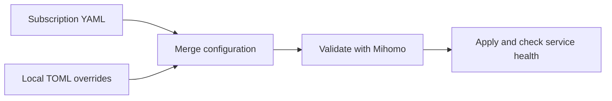

<div align="center">

# Mihoto

English | [简体中文](README.zh.md)

**Mihomo on Linux. From first install to everyday operation.**

Install the core, connect your subscription, and manage your system service.<br />
One CLI for configuration, dashboards, scheduled updates, and upgrades.

[](https://github.com/Pectics/mihoto/releases/latest)
[](https://github.com/Pectics/mihoto/actions/workflows/ci.yml)
[](https://github.com/Pectics/mihoto/releases)
[](LICENSE)

**[Quick start](#quick-start)** · **[Configuration](#configuration)** · **[Commands](#everyday-commands)** · **[FAQ](#faq)**

<sub>Linux + systemd · x86_64 / aarch64 · GNU / musl · Written in Rust</sub>

</div>

<br />

## Everything your Mihomo setup needs

Mihoto manages the lifecycle of a system-level Mihomo installation, from the first
subscription download to ongoing maintenance. Keep your local preferences in TOML
while your subscription supplies proxies, groups, and routing rules.

| | What you get |
| --- | --- |
| **🚀 Guided setup** | Run `mihoto init`, enter your subscription URL, and let Mihoto prepare the core, configuration, geodata, dashboard, and systemd service. |
| **🧩 Persistent local settings** | Keep ports, controller settings, and other managed overrides in one TOML file. Subscription refreshes preserve your preferences. |
| **🖥️ Your dashboard of choice** | Built-in asset management for MetaCubeXD, Zashboard, Yacd-meta, or a custom dashboard archive. |
| **⏱️ Scheduled refreshes** | A systemd timer keeps the subscription up to date. Update the core, dashboard, and geodata separately or together. |
| **🛡️ Validated configuration** | Check staged configuration with Mihomo before replacement, verify service health, and restore the previous configuration if the health check fails. |
| **📦 Verified distribution** | Installer and self-upgrade verify SHA256 checksums and smoke-test the executable before atomically replacing the manager binary. |

## Quick start

You need a **Linux host running systemd**, root access through `sudo`, and a
**Mihomo-compatible subscription URL**. See [supported systems](#supported-systems)
for architecture and host requirements.

### 1. Install Mihoto

```sh
curl -fsSL https://raw.githubusercontent.com/Pectics/mihoto/main/install.sh | sudo sh
```

The installer selects the latest stable release and installs it to
`/usr/local/bin/mihoto` after verification.

### 2. Initialize your service

```sh
sudo mihoto init
```

Enter your remote subscription URL when prompted. Mihoto saves the manager
configuration to `/etc/mihoto.toml`, downloads the required components, validates
the configuration, and enables and starts `mihomo.service`. Each stage reports
its result, so repeat runs are easy to follow.

### 3. Check your setup

```sh
mihoto status
mihoto timer status
```

With the default configuration, open **[the local dashboard](http://127.0.0.1:9090/ui/)**
on the host running Mihoto. The mixed HTTP/SOCKS proxy listens on port **7890**.
For a remote server, see [dashboard access](#dashboards).

> [!TIP]
> Successful initialization also configures subscription refreshes every **12 hours**
> by default. Change `auto_update_interval` in `/etc/mihoto.toml` and run
> `sudo mihoto apply` to adjust the schedule; set it to `0` to disable it.

<details>
<summary><strong>Other installation options: pinned versions, release archives, and source</strong></summary>

#### Pin a version

Use `--version <semver>` for a specific stable release or release candidate:

```sh
curl -fsSL https://raw.githubusercontent.com/Pectics/mihoto/main/install.sh \
  | sudo sh -s -- --version v1.0.0
```

`--mirror` may proxy archive downloads. GitHub release metadata and `SHA256SUMS`
remain the verification source. A failed or interrupted install leaves the
previous binary untouched.

#### Use a release archive

Download the archive for your target and `SHA256SUMS` from
[Releases](https://github.com/Pectics/mihoto/releases/latest).
See [release verification](#updates-and-verification) before installing it.

#### Build from source

```sh
git clone https://github.com/Pectics/mihoto.git
cd mihoto
cargo build --release
sudo install -m 755 target/release/mihoto /usr/local/bin/mihoto
```

</details>

## Everyday commands

Use `sudo` for commands that change system state. Status, logs, completions,
`timer status`, and `upgrade --check` are read-only and do not load or create the
manager configuration.

| Task | Command |
| --- | --- |
| Initialize the installation | `sudo mihoto init` |
| Refresh the subscription | `sudo mihoto update` |
| Apply local TOML overrides | `sudo mihoto apply` |
| Update every Mihomo component | `sudo mihoto update --all` |
| Update only the core | `sudo mihoto update --core` |
| Update only dashboard assets | `sudo mihoto update --ui` |
| Update only geodata | `sudo mihoto update --geodata` |
| Start / stop / restart the service | `sudo mihoto start` / `sudo mihoto stop` / `sudo mihoto restart` |
| Inspect service status / follow logs | `mihoto status` / `mihoto log` |
| Enable / disable subscription refreshes | `sudo mihoto timer enable` / `sudo mihoto timer disable` |
| Inspect the update timer | `mihoto timer status` |
| Check / install a Mihoto upgrade | `mihoto upgrade --check` / `sudo mihoto upgrade` |
| Generate shell completions | `mihoto completions bash` / `mihoto completions zsh` / `mihoto completions fish` |

Run `mihoto --help` or `mihoto <command> --help` for available options.
Use the global `--config /absolute/path/to/config.toml` option before the command
to select a different manager configuration.

## Configuration

**Your subscription supplies the routing configuration. Your TOML file controls
local preferences.** Edit `/etc/mihoto.toml`; Mihoto generates the final
`/etc/mihomo/config.yaml` for the core.

The following is a minimal example. Replace the subscription URL with your own;
omitted settings use Mihoto's defaults.

```toml
remote_config_url = "https://example.com/your-mihomo-subscription.yaml"
ui = "metacubexd"
mihomo_channel = "stable"
auto_update_interval = 12

[mihomo_config]
mixed_port = 7890
allow_lan = false
mode = "rule"
log_level = "info"
external_controller = "127.0.0.1:9090"
```

After editing:

```sh
sudo mihoto apply
```

If you change `remote_config_url`, run `sudo mihoto update` to fetch the new
subscription. If you change `ui`, run `sudo mihoto update --ui` to download the
selected dashboard assets.

### How settings reach Mihomo



The `[mihomo_config]` settings, including their defaults, override the corresponding
YAML fields. Unmanaged fields such as `tun`, `dns`, `proxies`, `proxy-groups`,
`rules`, and other extension fields pass through unchanged. The
[configuration model](src/domain/config.rs) lists all managed fields and defaults.

### Dashboards

Set the top-level `ui` field in `/etc/mihoto.toml`:

| Dashboard | Value |
| --- | --- |
| MetaCubeXD — default | `"metacubexd"` |
| Zashboard | `"zashboard"` |
| Yacd-meta | `"yacd-meta"` |
| Custom dashboard archive | `"custom:https://example.com/dashboard.tar.gz"` |

Mihomo serves the installed assets at **[http://127.0.0.1:9090/ui/](http://127.0.0.1:9090/ui/)**
with the default controller settings. To access a remote host's dashboard, forward
the controller port over SSH, replacing `user@your-server` with your SSH destination:

```sh
ssh -L 9090:127.0.0.1:9090 user@your-server
```

Then open the same local dashboard address in your browser.
Exposing the controller beyond loopback must be an explicit configuration choice
protected by a `secret` in `[mihomo_config]`.

### TUN and DNS

TUN is a supported use case. The system service runs as root with `CAP_NET_ADMIN`
and `CAP_NET_RAW`. Supply a working `tun` and `dns` configuration, including the
required TUN DNS hijack settings, in your subscription YAML.

Profiles exported by GUI clients may omit the DNS and TUN settings those clients
inject at runtime. Such profiles need those settings added before they can serve
as standalone Mihomo configurations.

## Supported systems

**Mihoto supports systemd Linux only.** Choose the release target that matches
your host architecture and C library:

| Architecture | GNU libc | musl libc |
| --- | --- | --- |
| x86_64 | `x86_64-unknown-linux-gnu` | `x86_64-unknown-linux-musl` |
| aarch64 / ARM64 | `aarch64-unknown-linux-gnu` | `aarch64-unknown-linux-musl` |

Release acceptance covers Ubuntu 22.04 and Ubuntu 24.04 on x86_64, plus a separate
native or virtualized aarch64 systemd/TUN host. Containers without the required
privileges, non-systemd Linux, Android, BSD, macOS, and Windows are not supported.

The stable **1.x product contract** defines the supported commands, system paths,
and failure behavior. Read the [public contract](docs/v1-contract.md),
[v1.0.0 release notes](docs/releases/v1.0.0.md), and
[acceptance record](docs/audits/v1.0.0.md) for details.

## Updates and verification

**`update` maintains Mihomo. `upgrade` maintains Mihoto itself.**

```sh
sudo mihoto update --all   # Subscription, geodata, dashboard, and Mihomo core
mihoto upgrade --check    # Check for a newer stable Mihoto release
sudo mihoto upgrade      # Verify and install the manager upgrade
```

Self-upgrade selects a newer stable semantic version and ignores pre-releases by
default. It verifies `SHA256SUMS`, validates the archive, smoke-tests the staged
executable, and atomically replaces the manager binary. A failed upgrade leaves
the current binary unchanged.

<details>
<summary><strong>Verify a downloaded release archive</strong></summary>

Each release provides four target archives, `SHA256SUMS`, and a GitHub build
attestation/provenance record. In the directory containing your downloaded archive
and checksum file, run:

```sh
sha256sum --check --ignore-missing SHA256SUMS
gh attestation verify mihoto-v1.0.0-x86_64-unknown-linux-gnu.tar.gz \
  --repo Pectics/mihoto
```

Replace the example archive name with your downloaded version and target.
The checksum command verifies downloaded files without requiring all four archives.

</details>

## FAQ

<details>
<summary><strong>What happens if a configuration update fails?</strong></summary>

Mihoto validates staged configuration with the installed core before replacing the
active file. After replacement, it checks that the service remains active without
an increased restart counter. A failed health check restores the previous
configuration and service. Failed component updates skip the final service restart
rather than restart on partial state. Inspect `mihoto log` for service details.

</details>

<details>
<summary><strong>Can I initialize Mihoto without interactive prompts?</strong></summary>

Yes. Prepare `/etc/mihoto.toml` with a valid `remote_config_url`, then run
`sudo mihoto init --yes`. The flag suppresses prompting; it does not supply missing
configuration. Interactive `sudo mihoto init` creates the default file and asks
for the URL when needed.

</details>

<details>
<summary><strong>Does Mihoto manage a per-user service?</strong></summary>

Mihoto manages system-level units and requires explicit root execution for state
changes. User-level services, user cron, and user-directory installation are
outside its scope. Read-only commands do not require manager configuration;
access to service logs still depends on the host's journal permissions.

</details>

<details>
<summary><strong>How do I migrate from Mihoro?</strong></summary>

Earlier per-user Mihoro installations are not migrated automatically. Back up any
data you need, disable the old user service manually, and remove old user files
before initializing Mihoto. The old `setup`, `proxy`, and `cron` commands do not
exist in the v1 CLI.

</details>

<details>
<summary><strong>How do I uninstall, and what gets removed?</strong></summary>

Stop and remove Mihoto's system units while keeping configuration and binaries
for a future reinstall:

```sh
sudo mihoto uninstall
```

To also delete Mihoto-managed persistent data and binaries:

```sh
sudo mihoto uninstall --purge --yes
```

The purge operation is limited to the managed locations below. Unrelated units,
networking, firewall settings, and user files are outside its scope.

| Purpose | Default location |
| --- | --- |
| Manager configuration | `/etc/mihoto.toml` |
| Mihoto binary | `/usr/local/bin/mihoto` |
| Mihomo binary | `/usr/local/bin/mihomo` |
| Mihomo configuration, dashboard, and data | `/etc/mihomo` |
| Mihomo service | `/etc/systemd/system/mihomo.service` |
| Update service | `/etc/systemd/system/mihoto-update.service` |
| Update timer | `/etc/systemd/system/mihoto-update.timer` |

</details>

## Contributing

Bug reports, documentation improvements, and focused pull requests are welcome.
[Open an issue](https://github.com/Pectics/mihoto/issues) with your host architecture,
Mihoto version, command, and relevant logs. Remove subscription URLs, secrets, and
other credentials before sharing them.

The Rust codebase separates CLI presentation, application workflows, domain rules,
and infrastructure adapters. See [AGENTS.md](AGENTS.md) for the project map and
local development conventions.

<details>
<summary><strong>Development and acceptance checks</strong></summary>

```sh
cargo fmt --all -- --check
cargo clippy --all-targets -- -D warnings
cargo check --all-targets
cargo test --all-targets
cargo test --all-targets --no-default-features
scripts/check-system-scope.sh
scripts/check-release-workflow.sh
scripts/check-v1-contract.sh
scripts/test-installer-contract.sh
```

The real systemd/TUN scripts require an isolated rootful host. They mutate Mihoto
fixtures under `/etc`, `/usr/local/bin`, and `/etc/systemd/system`, then check
cleanup. Missing root/systemd/TUN prerequisites are a blocked acceptance result,
never a pass.

</details>

## License

[MIT](LICENSE) · Copyright © 2023 Spencer (Shangbo Wu), © 2026 Pectics.

<div align="center">

<br />

**Mihomo, managed.**

[Get Mihoto](https://github.com/Pectics/mihoto/releases/latest) · [Report an issue](https://github.com/Pectics/mihoto/issues) · [Explore the source](src/)

</div>
