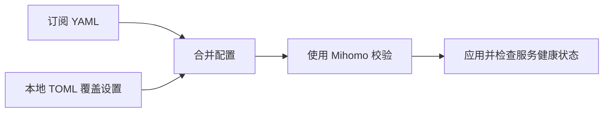

<div align="center">

# Mihoto

[English](README.md) | 简体中文

**在 Linux 上使用 Mihomo，从首次安装到日常管理。**

安装内核、接入订阅、管理系统服务。<br />
用一个 CLI 完成配置、面板部署、定时更新与版本升级。

[](https://github.com/Pectics/mihoto/releases/latest)
[](https://github.com/Pectics/mihoto/actions/workflows/ci.yml)
[](https://github.com/Pectics/mihoto/releases)
[](LICENSE)

**[快速开始](#快速开始)** · **[配置说明](#配置说明)** · **[常用命令](#常用命令)** · **[常见问题](#常见问题)**

<sub>Linux + systemd · x86_64 / aarch64 · GNU / musl · 使用 Rust 编写</sub>

</div>

<br />

## 管好你的 Mihomo，从安装到维护

Mihoto 负责系统级 Mihomo 安装的完整生命周期，从第一次下载订阅，到之后的日常维护。
将本地偏好保存在 TOML 中，由订阅提供代理节点、策略组与路由规则。

| | 你可以获得 |
| --- | --- |
| **🚀 引导式安装** | 运行 `mihoto init`，输入订阅地址，即可准备内核、配置、地理数据、Web 面板和 systemd 服务。 |
| **🧩 持久化本地配置** | 在一个 TOML 文件中管理端口、控制器等覆盖设置，刷新订阅时仍保留本地偏好。 |
| **🖥️ 自由选择面板** | 内置 MetaCubeXD、Zashboard、Yacd-meta 的资源管理，也支持自定义面板压缩包。 |
| **⏱️ 定时刷新订阅** | 通过 systemd 定时器自动更新订阅；内核、面板和地理数据可单独更新，也可一次全部更新。 |
| **🛡️ 配置校验与恢复** | 替换配置前由 Mihomo 校验，应用后检查服务健康状态，检查失败时恢复之前的配置。 |
| **📦 安装与升级校验** | 安装器和自升级会验证 SHA256 校验和，并对可执行文件进行冒烟测试，再原子替换管理器程序。 |

## 快速开始

准备一台**运行 systemd 的 Linux 主机**、通过 `sudo` 获取的 root 权限，以及一个
**兼容 Mihomo 的订阅地址**。架构和主机要求详见[支持的系统](#支持的系统)。

### 1. 安装 Mihoto

```sh
curl -fsSL https://raw.githubusercontent.com/Pectics/mihoto/main/install.sh | sudo sh
```

安装器默认选择最新稳定版，验证通过后安装到 `/usr/local/bin/mihoto`。

### 2. 初始化服务

```sh
sudo mihoto init
```

根据提示输入远程订阅地址。Mihoto 会将管理配置保存到 `/etc/mihoto.toml`，下载所需组件，
校验配置，并启用、启动 `mihomo.service`。每个阶段都会报告结果，重复运行也能清楚了解进度。

### 3. 检查运行状态

```sh
mihoto status
mihoto timer status
```

使用默认配置时，在运行 Mihoto 的主机上打开**[本地面板](http://127.0.0.1:9090/ui/)**。
HTTP/SOCKS 混合代理监听端口为 **7890**。远程服务器的访问方式见 [Web 面板](#web-面板)。

> [!TIP]
> 初始化成功后，默认还会配置每 **12 小时**刷新一次订阅。
> 修改 `/etc/mihoto.toml` 中的 `auto_update_interval`，再运行 `sudo mihoto apply`
> 即可调整周期；设为 `0` 可关闭定时更新。

<details>
<summary><strong>其他安装方式：指定版本、发行压缩包与源码编译</strong></summary>

#### 指定版本

使用 `--version <semver>` 安装指定稳定版或候选发布版：

```sh
curl -fsSL https://raw.githubusercontent.com/Pectics/mihoto/main/install.sh \
  | sudo sh -s -- --version v1.0.0
```

`--mirror` 可为压缩包下载设置代理，但验证仍以 GitHub 发布元数据和 `SHA256SUMS` 为准。
安装失败或中断时，原有程序保持不变。

#### 使用发行压缩包

从 [Releases](https://github.com/Pectics/mihoto/releases/latest) 下载适合目标平台的压缩包和
`SHA256SUMS`。安装前请参阅[更新与验证](#更新与验证)。

#### 从源码编译

```sh
git clone https://github.com/Pectics/mihoto.git
cd mihoto
cargo build --release
sudo install -m 755 target/release/mihoto /usr/local/bin/mihoto
```

</details>

## 常用命令

修改系统状态的命令需要使用 `sudo`。状态查询、日志、补全生成、`timer status` 和
`upgrade --check` 均为只读操作，不会读取或创建管理配置。

| 操作 | 命令 |
| --- | --- |
| 初始化安装 | `sudo mihoto init` |
| 刷新订阅 | `sudo mihoto update` |
| 应用本地 TOML 覆盖设置 | `sudo mihoto apply` |
| 更新所有 Mihomo 组件 | `sudo mihoto update --all` |
| 仅更新内核 | `sudo mihoto update --core` |
| 仅更新面板资源 | `sudo mihoto update --ui` |
| 仅更新地理数据 | `sudo mihoto update --geodata` |
| 启动 / 停止 / 重启服务 | `sudo mihoto start` / `sudo mihoto stop` / `sudo mihoto restart` |
| 查看服务状态 / 持续查看日志 | `mihoto status` / `mihoto log` |
| 启用 / 关闭订阅定时刷新 | `sudo mihoto timer enable` / `sudo mihoto timer disable` |
| 查看更新定时器状态 | `mihoto timer status` |
| 检查 / 安装 Mihoto 升级 | `mihoto upgrade --check` / `sudo mihoto upgrade` |
| 生成 Shell 补全 | `mihoto completions bash` / `mihoto completions zsh` / `mihoto completions fish` |

运行 `mihoto --help` 或 `mihoto <command> --help` 查看可用选项。
如需指定其他管理配置，在子命令前添加全局选项 `--config /absolute/path/to/config.toml`。

## 配置说明

**订阅提供路由配置，TOML 文件管理本地偏好。** 编辑 `/etc/mihoto.toml`，
由 Mihoto 为内核生成最终的 `/etc/mihomo/config.yaml`。

下面是一个最小配置示例。请替换为自己的订阅地址；省略的设置使用 Mihoto 默认值。

```toml
remote_config_url = "https://example.com/your-mihomo-subscription.yaml"
ui = "metacubexd"
mihomo_channel = "stable"
auto_update_interval = 12

[mihomo_config]
mixed_port = 7890
allow_lan = false
mode = "rule"
log_level = "info"
external_controller = "127.0.0.1:9090"
```

编辑后运行：

```sh
sudo mihoto apply
```

如果修改了 `remote_config_url`，运行 `sudo mihoto update` 获取新订阅。
如果修改了 `ui`，运行 `sudo mihoto update --ui` 下载所选面板的资源。

### 配置如何应用到 Mihomo



`[mihomo_config]` 中的设置（包括默认值）会覆盖对应的 YAML 字段。
不由 Mihoto 管理的字段，如 `tun`、`dns`、`proxies`、`proxy-groups`、`rules`
及其他扩展字段，会原样保留。[配置模型](src/domain/config.rs) 列出了所有受管理字段及默认值。

### Web 面板

在 `/etc/mihoto.toml` 中设置顶层 `ui` 字段：

| 面板 | 配置值 |
| --- | --- |
| MetaCubeXD — 默认 | `"metacubexd"` |
| Zashboard | `"zashboard"` |
| Yacd-meta | `"yacd-meta"` |
| 自定义面板压缩包 | `"custom:https://example.com/dashboard.tar.gz"` |

使用默认控制器配置时，Mihomo 会在
**[http://127.0.0.1:9090/ui/](http://127.0.0.1:9090/ui/)** 提供已安装的面板。
访问远程主机的面板时，可通过 SSH 转发控制器端口，将 `user@your-server` 替换为实际 SSH 地址：

```sh
ssh -L 9090:127.0.0.1:9090 user@your-server
```

然后在浏览器中打开同一个本地面板地址。
如需将控制器开放到回环地址之外，必须显式修改配置，并在 `[mihomo_config]` 中设置 `secret` 保护访问。

### TUN 与 DNS

Mihoto 支持 TUN 场景。系统服务以 root 身份运行，具有 `CAP_NET_ADMIN` 和 `CAP_NET_RAW` 权限。
请在订阅 YAML 中提供可用的 `tun` 和 `dns` 配置，包括所需的 TUN DNS 劫持设置。

GUI 客户端导出的配置可能省略由客户端在运行时注入的 DNS 和 TUN 设置。
这类配置需要补全这些设置，才能作为独立的 Mihomo 配置使用。

## 支持的系统

**Mihoto 仅支持使用 systemd 的 Linux 系统。** 请根据主机架构和 C 库选择发行目标：

| 架构 | GNU libc | musl libc |
| --- | --- | --- |
| x86_64 | `x86_64-unknown-linux-gnu` | `x86_64-unknown-linux-musl` |
| aarch64 / ARM64 | `aarch64-unknown-linux-gnu` | `aarch64-unknown-linux-musl` |

发布验收覆盖 x86_64 上的 Ubuntu 22.04 和 Ubuntu 24.04，以及独立的原生或虚拟化
aarch64 systemd/TUN 主机。不支持权限不足的容器、非 systemd Linux、Android、BSD、macOS 和 Windows。

稳定的 **1.x 产品契约**定义了受支持的命令、系统路径和失败处理行为。
详情参见[公共契约](docs/v1-contract.md)、[v1.0.0 发布说明](docs/releases/v1.0.0.md)
和[验收记录](docs/audits/v1.0.0.md)（英文）。

## 更新与验证

**`update` 维护 Mihomo，`upgrade` 升级 Mihoto 本身。**

```sh
sudo mihoto update --all   # 更新订阅、地理数据、面板与 Mihomo 内核
mihoto upgrade --check    # 检查是否有更新的 Mihoto 稳定版
sudo mihoto upgrade      # 验证并安装管理器升级
```

自升级按语义化版本选择更新的稳定版，默认忽略预发布版本。升级过程会验证 `SHA256SUMS`、
校验压缩包、对暂存的可执行文件进行冒烟测试，再原子替换管理器程序。
升级失败时，当前程序保持不变。

<details>
<summary><strong>验证下载的发行压缩包</strong></summary>

每次发布都提供四个目标平台的压缩包、`SHA256SUMS`，以及 GitHub 构建证明和来源记录。
在存放已下载压缩包和校验文件的目录中运行：

```sh
sha256sum --check --ignore-missing SHA256SUMS
gh attestation verify mihoto-v1.0.0-x86_64-unknown-linux-gnu.tar.gz \
  --repo Pectics/mihoto
```

将示例压缩包名称替换为实际下载的版本和目标平台。
校验命令只验证已下载的文件，无需下载全部四个压缩包。

</details>

## 常见问题

<details>
<summary><strong>配置更新失败会怎样？</strong></summary>

替换当前配置前，Mihoto 会使用已安装的内核校验暂存配置。替换后，检查服务是否持续运行，
并确认重启计数没有增加。健康检查失败时，会恢复之前的配置和服务。
组件更新失败时，会跳过最后的服务重启，避免在部分更新的状态下重启。
可通过 `mihoto log` 查看服务详情。

</details>

<details>
<summary><strong>可以不经过交互提示直接初始化吗？</strong></summary>

可以。提前准备好 `/etc/mihoto.toml` 并填写有效的 `remote_config_url`，
然后运行 `sudo mihoto init --yes`。该选项仅跳过交互提示，不会补齐缺失配置。
交互式运行 `sudo mihoto init` 时，会按需创建默认配置文件并询问订阅地址。

</details>

<details>
<summary><strong>Mihoto 支持用户级服务吗？</strong></summary>

Mihoto 管理系统级单元，修改状态时必须显式以 root 身份执行。
用户级服务、用户 cron 和用户目录安装均不在支持范围内。
只读命令不依赖管理配置；服务日志的访问权限仍取决于主机的 journal 权限设置。

</details>

<details>
<summary><strong>如何从 Mihoro 迁移？</strong></summary>

旧版用户级 Mihoro 安装不会自动迁移。请先备份需要保留的数据，手动停用旧的用户服务，
清理旧的用户文件，再初始化 Mihoto。v1 CLI 不再提供旧的 `setup`、`proxy` 和 `cron` 命令。

</details>

<details>
<summary><strong>如何卸载，会删除哪些内容？</strong></summary>

停止并删除 Mihoto 的系统单元，同时保留配置和程序，以便日后重新安装：

```sh
sudo mihoto uninstall
```

如果还要删除 Mihoto 管理的持久化数据和程序：

```sh
sudo mihoto uninstall --purge --yes
```

彻底卸载仅作用于下列受管理位置，不会修改无关单元、网络配置、防火墙设置或用户文件。

| 用途 | 默认位置 |
| --- | --- |
| 管理器配置 | `/etc/mihoto.toml` |
| Mihoto 程序 | `/usr/local/bin/mihoto` |
| Mihomo 程序 | `/usr/local/bin/mihomo` |
| Mihomo 配置、面板与数据 | `/etc/mihomo` |
| Mihomo 服务 | `/etc/systemd/system/mihomo.service` |
| 更新服务 | `/etc/systemd/system/mihoto-update.service` |
| 更新定时器 | `/etc/systemd/system/mihoto-update.timer` |

</details>

## 参与贡献

欢迎提交问题反馈、改进文档，以及目标明确的 Pull Request。
[提交 Issue](https://github.com/Pectics/mihoto/issues) 时，请附上主机架构、Mihoto 版本、
执行的命令及相关日志。分享前请移除订阅地址、密钥等凭据。

Rust 代码按 CLI 展示、应用工作流、领域规则和基础设施适配器分层。
项目结构和本地开发约定见 [AGENTS.md](AGENTS.md)（英文）。

<details>
<summary><strong>开发与验收检查</strong></summary>

```sh
cargo fmt --all -- --check
cargo clippy --all-targets -- -D warnings
cargo check --all-targets
cargo test --all-targets
cargo test --all-targets --no-default-features
scripts/check-system-scope.sh
scripts/check-release-workflow.sh
scripts/check-v1-contract.sh
scripts/test-installer-contract.sh
```

真实 systemd/TUN 验收脚本需要隔离且具有 root 权限的主机。
脚本会修改 `/etc`、`/usr/local/bin` 和 `/etc/systemd/system` 下的 Mihoto 测试资源，
随后检查清理结果。缺少 root、systemd 或 TUN 前置条件应视为验收受阻，而非通过。

</details>

## 许可证

[MIT](LICENSE) · 版权所有 © 2023 Spencer (Shangbo Wu)，© 2026 Pectics。

<div align="center">

<br />

**Mihomo，交给 Mihoto 管理。**

[下载 Mihoto](https://github.com/Pectics/mihoto/releases/latest) · [反馈问题](https://github.com/Pectics/mihoto/issues) · [浏览源码](src/)

</div>
